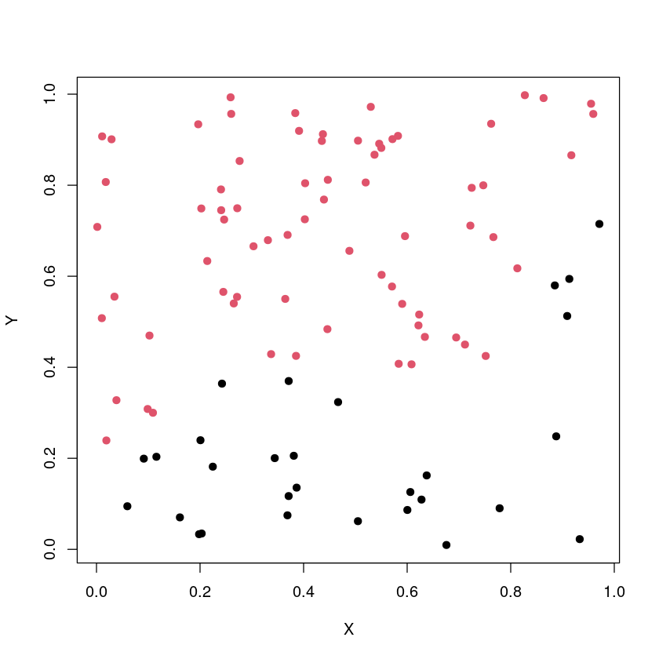
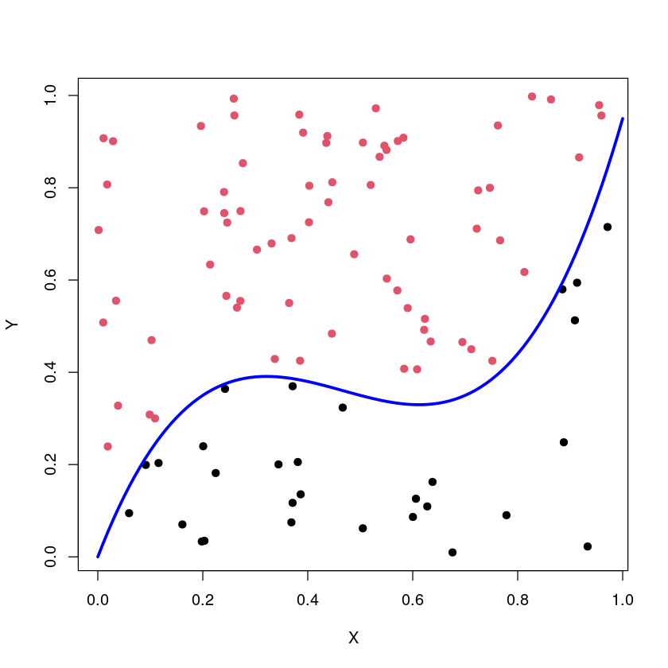
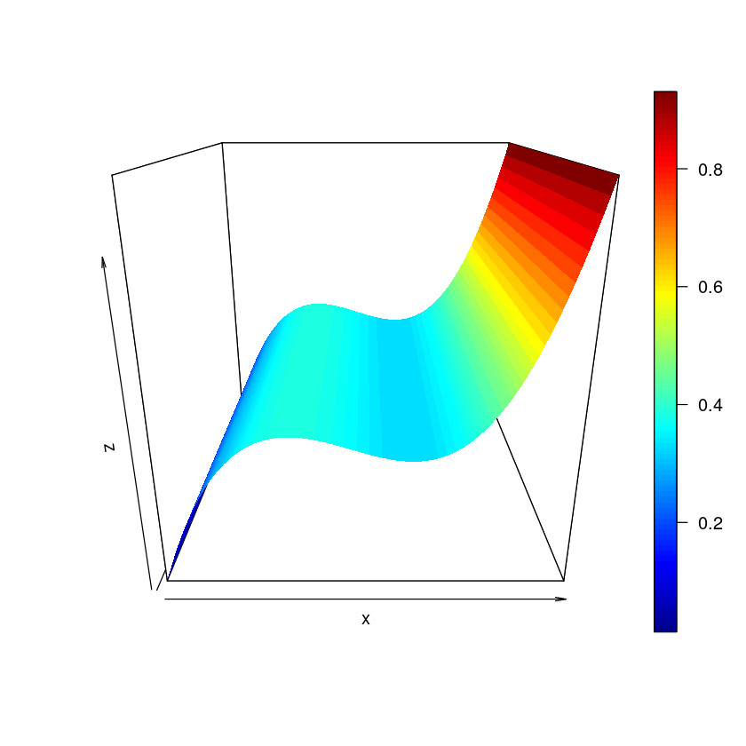
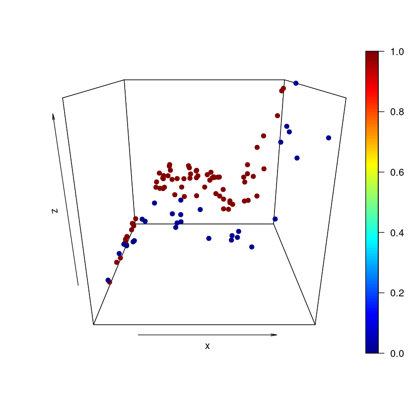
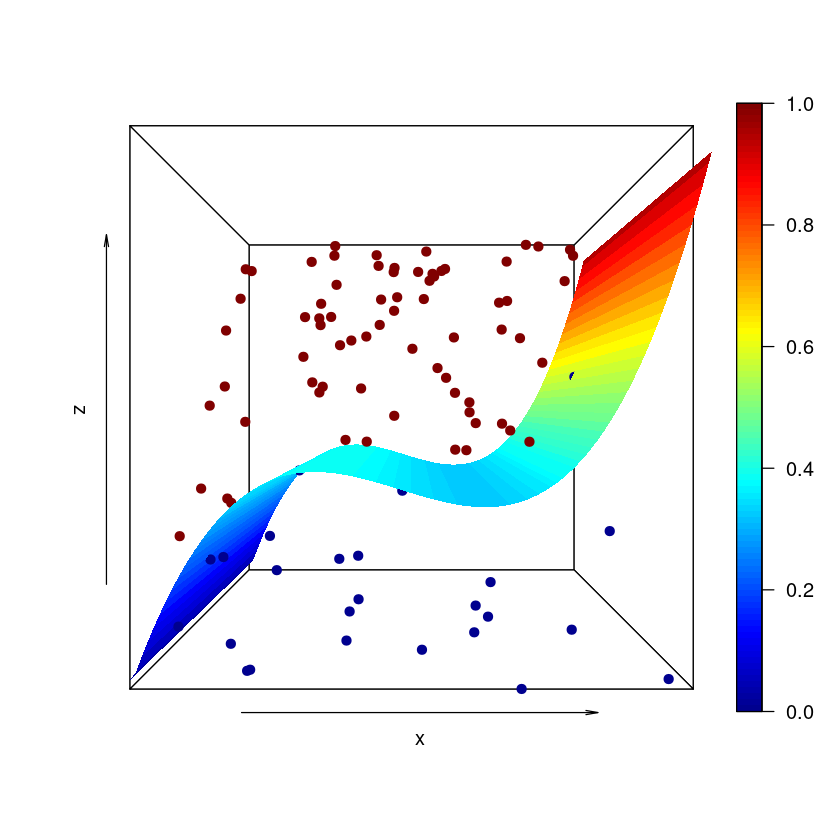
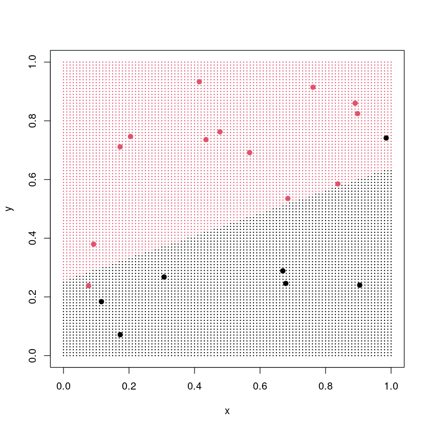

# Section 1: Toy Data

We're initially going to make use of some "toy data" to get to know the SVM code. We will generate some random numbers and then assign them to one of two classes (categorical response variable) based on their location in the parameter space.

```{r}

set.seed(314)

# Create two vectors of 100 random numbers, spread uniformly between 0 and 1 
x <- runif(100,0,1)
y <- runif(100,0,1)

# Classify the pairs of points - if the value of y is greater than 5x^3 - 1.4x^2 + 0.59x, the point is in class 1
# Otherwise it is in class 0 
class <- 5*(x*x*x - 1.4*x*x + 0.59*x)
z <- ifelse(y>class,1,0)

# Plot the scatterplot with category indicated by colour. 
plot(x,y,col=z+1,pch=19,xlab="X",ylab="Y")
```



If the value of Y is greater than $5(X^3 - 1.4X^2 + 0.59X)$, the point is assigned to class 1 (equivalent to positive or true); otherwise it is assigned to class 0 (equivalent to negative or false).

We can show this boundary on our plot by creating a variable `xax` that spans the X-axis, and calculating the value of the boundary line at each point along the X-axis.

```{r}
# Create a vector that is spaced along the range of the X-axis 
xax <- seq(0,1,length.out=101)

# Work out the value of the dividing surface between the categories for each point along the X-axis 
margin <- 5*(xax*xax*xax - 1.4*xax*xax + 0.59*xax)

# Plot the same scatter plot
plot(x,y,col=z+1,pch=19,xlab="X",ylab="Y")
# Draw the line of the dividing surface 
lines(xax,margin,lwd=3,col="blue")

```



To really understand the shape of the *surface*, we want to use a 3D plot. The colour scale is not readily legible for colour-blind students; however, in this instance, its only purpose is to give a sense of the shape/contouring of the surface, so I haven't changed the palette option. If you were required to read values from the figure, I would have used a more accessible palette.

```{r}

# Load the library to plot 3D surfaces 
library(plot3D)

# Create a grid based on the x-axis range (the y-axis covers the same range, so we don't need to redefine it)
M <- mesh(xax,xax)
# Pull the X and Y axis values out from the mesh variable
xaxis <- M$x
yaxis <- M$y

# Calculate the value of the dividing surface in two dimensions! 
# (Admittedly because, in this example, the surface only depends on x, 
# it doesn't need to be two-dimensional...)
zval <- 5*(xaxis*xaxis*xaxis - 1.4*xaxis*xaxis + 0.59*xaxis)

# Plot the surface in three dimensions
# Arguments for surf3D: 
# xaxis: grid with x-values for the surface being plotted
# yaxis: grid with y-values for the surface being plotted
# zval: height of surface being plotted 
# colvar: variable used to define the colour on the surface 
#         at a given (x,y) coordinate (in this case, still zval)
# colkey=TRUE: show a legend/colour bar
# box=TRUE: plot the x-y-z box around the surface 
# bty='b': box type, 'b' = back panel, 'f' = full box 
# phi: angle (height-related) the plot is shown from; -90 to +90 degrees
# theta: angle (x-y plane orientation) the plot is shown from; 0 to 360 degrees
surf3D(xaxis,yaxis,zval,colvar=zval,colkey=TRUE,box=TRUE,bty='b',phi=20,theta=0)

```



The surface is constant in the Y-direction because it *only* depends on X-values. If you are looking for an advanced challenge, you may choose to create a data set with a different boundary, which *does* depend on both X and Y.

We can also plot the points in three-dimensional space, with a colour coding based on their class.

```{r}

# Plot a three-dimensional scatterplot showing the position and class of the points
# This time, colvar=z, which is 0 or 1 depending on the category
scatter3D(as.matrix(x),as.matrix(y),as.matrix(class),colvar=z,phi=20,theta=0,pch=19)


```



However, without including the surface, it is difficult to understand the separation between the two classes. We can use the `surf` argument to `scatter3D` to include the surface in our 3D scatterplot!

```{r}

# Plot a three-dimensional scatterplot *and* the dividing surface 
scatter3D(as.matrix(x),as.matrix(y),as.matrix(y),colvar=z,phi=00,theta=0,pch=19,surf=list(x=xaxis,y=yaxis,z=zval,colvar=zval))

```



So far, we have *created* and *plotted* our toy data. Because we are using toy data, we know the actual formula of the decision boundary. We use the `svm` function from the `e1071` library to create an SVM to classify points in our parameter space, based on our toy data set.

Our first model will just use a "standard" straight line within the parameter space to classify the data.

```{r}
# Load the miscellaneous stats package
library(e1071)

# Create a data frame holding the toy data 
# Make sure you define your category as a FACTOR
classes <- data.frame(x=x,y=y,z=as.factor(z))

# Define your test and training data
test_index <- sample(1:nrow(classes),20)

train <- classes[-test_index,]
test <- classes[test_index,]

# Create a support vector machine based on the data
# The syntax z~. means to use z as the response variable, and 
# every other variable in data as feature variables. 
# We have already scaled our data to be normal. 
# The KERNEL is linear - we are just using a straight line here! 
fit <- svm(z~.,data=train,scale=FALSE,kernel="linear")

# Check the confusion matrix of your model's output
test$prediction <- predict(fit,newdata=test)
table(test$prediction,test$z)
```

```         
     0  1
  0  5  0
  1  1 14
```

This toy data set is very small. My value of `set.seed(314)` give 95% accuracy on the test data set, but it was only testing 20 points (and only trained on 80). We **know** that the dividing barrier isn't really a straight line, because we created the data ourselves; but this linear approximation is adequate for our purposes. The model we have created *is* wrong, but is still likely to be useful for a simple classification task *when we do not know the real underlying decision boundary*.

It is possible, but not straightforward, to retrieve the fit coefficients for the decision boundary when using the `svm()` function and plot the dividing line. However, it is *much easier* to simply define a two-dimensional grid of points and *assign* each of those points to a class based on the SVM we have created, and to delineate the two classes by shading the background of the plot.

```{r}

# Create a grid of points covering the x and y parameter space 
# You can name the axis of your grid anything (I have chosen x and y 
# to match the input variables for the `fit` model object defined above), 
# and pass it any values (I have chosen my 101 evenly spaced points 
# along the range [0,1] already held in the `xax` variable)
xgrid = expand.grid(x = xax, y = xax)

# Predict the category of each point on that grid, based on the fit
ygrid = predict(fit, newdata=xgrid)

# Shade the categories defined by the support vector machine using small points
plot(xgrid, col = as.numeric(ygrid), pch = 20, cex = .2)

# Then add larger points showing your actual data values 
points(x, y, col = z + 1, pch = 19)

# Alternatively, comment out the above line and only plot your test data 
# points(x[test_index],y[test_index],col=z[test_index]+1,pch=19)
```



#### Optional Exercise For After Workshop

Create a large data set with a different decision boundary (possibly involving multiple input variables). See how good or bad of a job the linear kernel in the `svm()` function does at modelling your toy data.

**NBB Please *do not* do this *during* the workshop, as if everyone creates large data sets this may cause the server to crash.**

#### Exercise 1: Try Different Kernels

The main kernel types included in `svm()` are linear, polynomial, radial, and sigmoid. When you use these kernels, you may need to include extra arguments; for example, `degree` for polynomial, `gamma` for radial. (If you do not provide explicit values for these optional arguments, the default will be used - the code will still work, and at this point in your training, the default values are likely to be sufficient.)

##### Try each of these kernel types to create models, and compare your accuracy, both in terms of percentage of test data classified correctly, and in the more subjective visual sense of how closely the model's boundary matches the known, theoretical value.

##### Can you reproduce the true polynomial decision boundary accurately using a polynomial kernel of degree 3?

The **maximum** value of `cost` that you should use for any SVM *during the workshop* is 1000, since you will all be creating SVMs at the same time and if their costs are too high, this may cause issues with the server.

# Section 2: Real-World Data

Toy data is useful for understanding the basic procedure of data science, and for getting a sense of the limitations of the methodology. But if we want to know how to actually employ a particular methodology, we need to use some real-world data. I have uploaded a data set based on photographs of pumpkin seeds to the NCC server (please see lecture slides for links and metadata).

#### Exercise 2: Build Your Own SVM

##### Based on the sample code used in Exercise 1, and making use of the code below, create an SVM of your choice to classify the pumpkin seeds.

-   Create appropriate test and training data sets
-   Create your SVM using a kernel of your choice
-   Calculate the confusion matrix for your test data
-   Calculate your SVM's accuracy based on your test data

##### "Best" Subset Selection

I have used a moderately unscientific and somewhat arbitrary method to decide that the following variables are the most important ones to include when analysing this data set:

`select_vars <- c("Minor_Axis_Length", "Eccentricity", "Solidity", "Extent", "Roundness", "Class")`

Re-create the same SVM (same kernel, same cost, same e.g. gamma value or degree) using *just* these feature variables. Does your accuracy change? By how much? Does this tell you anything about your original model?

```{r}
# Real-world data: what type of pumpkin seed? 
pumpkin <- read.csv("Pumpkin_Seeds_Dataset.csv",header=TRUE)

# Convert the response variable to a factor
pumpkin$Class <- as.factor(pumpkin$Class)

# Check the maximum and minimum values of each feature variable 
# apply(pumpkin,2,min)
# apply(pumpkin,2,max)

# Scale the feature variables onto the range [0,1]
# apply(data, margin, function, ...)
# margin = 1 for rows, 2 for columns (remember ROW, COLUMN)
# I have defined a function here that subtracts the minimum value of each column, 
# and then divides by the range of the column; so min(x) goes to 0, max(x) goes
# to 1, and the other points are scaled appropriately to the range [0,1]
pumpkin[,1:12] <- apply(pumpkin[,1:12],2,function(x) (x-min(x))/(max(x)-min(x)))

# Check the maximum and minimum values again
# apply(pumpkin,2,min)
# apply(pumpkin,2,max)

# Choose your random seed to ensure consistent test/training data
# or comment out to see how a few different sets work 
# set.seed(314)

```
